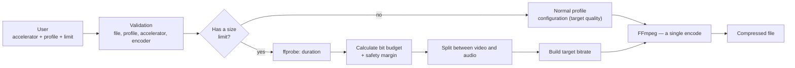
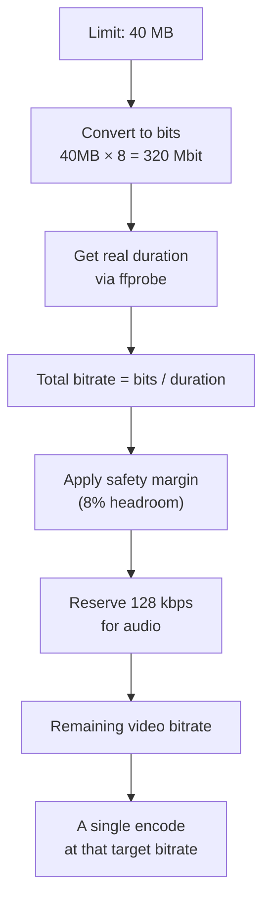

# 🎬 ClipSqueeze

🇧🇷 [Português](README.md) | 🇺🇸 English

**Smart video compression, right from your PowerShell terminal — CPU or GPU, profiles with real intent, and used the way you actually work: no need to memorize a single FFmpeg flag.**

<p align="center">
  
  
  
  
  
</p>

---

## 💡 Why this project exists

Compressing a quick video to send over Discord or WhatsApp shouldn't require knowing the difference between CRF and QP, what a `veryslow` preset even means, or why your 200MB file simply won't pass anyone's upload limit.

**ClipSqueeze** is built around a single PowerShell command, `Compress-Video`, that acts as an abstraction layer over FFmpeg: you say **where** to process (CPU or GPU), **how** to prioritize (speed, balance, efficiency, or quality), and, if you want, **how big** the final file can be. The script handles the rest.

```powershell
Compress-Video gpu "meeting_recording" efficient 40mb
```

That's all you need to know to use it.

---

## 📑 Table of Contents

- [Features](#-features)
- [How it works](#-how-it-works)
- [Requirements](#️-requirements)
- [Installation](#-installation)
- [Usage](#-usage)
- [Compression profiles](#️-compression-profiles)
- [Size limit](#-size-limit)
- [Example run](#️-example-run)
- [Error handling](#-error-handling)
- [Technical challenges solved](#-technical-challenges-solved)
- [Known limitations](#-known-limitations)
- [Roadmap](#️-roadmap)
- [Contributing](#-contributing)
- [License](#-license)

---

## ✨ Features

- 🔍 **Automatic file detection** — paste the video name without an extension, the script finds the right file on its own.
- 📊 **Real progress panel** — a bar that actually fills up, elapsed time, estimated time remaining, and encoding speed, all live.
- ⚡ **CPU or GPU** — encode via `libx265` (software) or AMD hardware acceleration (`hevc_amf`), without needing to know which encoder to pick.
- 🎚️ **Profiles with intent, not raw presets** — `fast`, `balanced`, `efficient`, and `quality` mean the same thing regardless of which accelerator you choose.
- 📦 **Optional size constraint** — say `40mb` and the script calculates the bitrate needed from the video's real duration, with a safety margin. One single encode, no trial and error.
- 🛠️ **FFmpeg self-diagnosis** — checks whether `ffmpeg`/`ffprobe` are installed and offers to install via `winget` on the spot if something's missing.
- 🧯 **Real error handling** — a log is saved automatically whenever something goes wrong.

---

## 🧠 How it works

The core idea is to separate **intent** from **implementation**. You never talk to FFmpeg directly — you talk to a profile, and the profile knows how to translate that into the right encoder settings.



When you set a size limit (e.g. `40mb`), the script mathematically calculates the bitrate that should produce a file within budget, applies a fixed safety margin (to account for container overhead), and encodes **once**.

The size limit is treated as a **constraint**, not a target to fill. If the result comes out 10% under the limit, that's fine — the script won't try to "use up" the remaining space.

---

## 🛠️ Requirements

- Windows 10 (1809+) or Windows 11
- PowerShell 5.1 or later
- [FFmpeg](https://www.gyan.dev/ffmpeg/builds/) (the script detects if it's missing and offers to install it via `winget` automatically)
- For GPU acceleration: an AMD card with AMF support (encoder availability is checked automatically before any compression)

---

## 📦 Installation

1. Download `ClipSqueeze.ps1` from this repository and save it in a folder of your choice.
2. Open your PowerShell profile:
   ```powershell
   notepad $PROFILE
   ```
3. At the end of the file, add the line below — replace `C:\path\to\ClipSqueeze.ps1` with the actual path to where you saved the file in step 1:
   ```powershell
   . "C:\path\to\ClipSqueeze.ps1"
   ```
4. Save, close the editor, and reopen your terminal (or run `. $PROFILE` to reload without closing it).

If FFmpeg isn't installed yet, don't worry — on first run the script detects that and asks if it can install it via `winget` for you.

---

## 🚀 Usage

```powershell
Compress-Video <accelerator> <file> [profile] [limit]
```

> The alias `comprimir` (Portuguese for "compress") works exactly the same way and is kept for backward compatibility with the tool's original workflow.

| Parameter | Required | Accepted values | Default |
|---|---|---|---|
| `accelerator` | ✅ | `cpu`, `gpu` | — |
| `file` | ✅ | Video name or path (with or without extension) | — |
| `profile` | ❌ | `fast`, `balanced`, `efficient`, `quality` | `balanced` |
| `limit` | ❌ | Max file size, e.g. `40mb` | No limit |

### Examples

```powershell
# Simple compression, balanced profile, no size restriction
Compress-Video cpu "meeting_recording"

# GPU with the best visual quality profile
Compress-Video gpu "meeting_recording" quality

# GPU prioritizing efficiency, staying under 40MB (e.g. Discord's upload limit)
Compress-Video gpu "meeting_recording" efficient 40mb

# Quick CPU pass for a disposable preview
Compress-Video cpu "meeting_recording" fast
```

Notice you don't need to type the file extension — if `meeting_recording.mp4` exists in the current folder, the script finds it on its own.

---

## 🎛️ Compression profiles

Each profile represents an **intent**, implemented differently depending on the chosen accelerator:

| Profile | Intent | CPU (`libx265`) | GPU (`hevc_amf`) |
|---|---|---|---|
| `fast` | Quick, not too concerned with file size | `preset veryfast`, `crf 27` | `quality speed`, `qvbr 32` |
| `balanced` *(default)* | Balance between time, quality, and size | `preset medium`, `crf 23` | `quality balanced`, `qvbr 26` |
| `efficient` | Smaller file while keeping the target quality | `preset veryslow`, `crf 23` | `quality quality`, `qvbr 26` |
| `quality` | Prioritizes visual fidelity above everything | `preset slow`, `crf 18` | `quality quality`, `qvbr 20` |

> **Note on `efficient` vs `quality`:** The two names seem synonymous, but they represent different objectives.

>
> - **`efficient`** maintains the **same quality target** as the `balanced` profile (same CRF on the CPU, same `qvbr_quality_level` on the GPU), but uses a more expensive encoding configuration (preset `veryslow` on the CPU, `quality` on the `-quality` of the GPU) to extract more compression efficiency *at that same quality level* — the result tends to be a smaller file with similar visual fidelity, at the cost of more processing time.

> - **`quality`** changes the **target itself** (lower CRF, lower `qvbr_quality_level`), prioritizing visual fidelity over file size — the result tends to be a larger file.

>
> In other words: `efficient` answers "I want the same quality using less space", while `quality` answers "I want more quality, even if it costs more space".
> On GPU, the rate control mode used is `qvbr` (Quality Variable Bitrate) — the closest equivalent to CRF that AMD's hardware encoder offers.

---

## 📏 Size limit

When you pass something like `40mb`, the script follows this reasoning:



The safety margin exists because the theoretical bitrate calculation isn't an exact mathematical guarantee — container overhead, metadata, and encoder variance can make the physical file slightly different from what was predicted. Instead of compensating for that with multiple attempts, the script starts from a slightly more conservative budget.

---

## 🖥️ Example run

```
=============================================
 Compression forecast
=============================================
 Elapsed time    : 00:00:54
 Time remaining  : done
 Speed           : 1.8x

 Progress: [########################################] 100%

 Accelerator: gpu | Profile: efficient | Limit: 20mb
 Output: 1920x-2
=============================================================

File: meeting_recording.mp4
Accelerator: gpu
Profile: efficient
Limit: 20mb

Duration: 00:33
Video bitrate (target): 4332 kbps
Audio bitrate: 128 kbps

Compression complete.

Original size: 277.4 MB
Final size: 18.7 MB
Reduction: 93.3%
```

*(Real test output — feel free to replace this with a GIF/asciinema recording of the terminal running live.)*

---

## 🧯 Error handling

- **FFmpeg missing** → the script detects this and offers to install it via `winget` (the `Gyan.FFmpeg` package) right there, without leaving the terminal.
- **GPU encoder unavailable** → before attempting to use the GPU, the script confirms `hevc_amf` is present in your FFmpeg's encoder list — if your card doesn't support it, you get a clear warning instead of a generic FFmpeg error.
- **Actual encoding failure** → FFmpeg's `stderr` is automatically saved as `<name>_erro_compressao.log`, in the same folder as the video.
- **Output file already exists** → the script asks before overwriting.
- **Unfeasible size limit** → if the given limit is too small for the video's duration, the script refuses the compression instead of producing an unusable file.

---

## 🐛 Technical challenges solved

A few bugs that came up during development and are worth documenting, because they weren't obvious:

- **Locale-sensitive parsing**: on systems set to `pt-BR`, `[double]::TryParse("33.003000")` reads the dot as a thousands separator instead of a decimal point — turning 33 seconds into ~33 million. Fixed by forcing `CultureInfo.InvariantCulture` on every numeric conversion coming from `ffprobe`/`ffmpeg`.
- **False-positive error**: `Start-Process -PassThru` in PowerShell can return `.ExitCode = $null` even after a successful run, if the process handle isn't accessed right after `Start-Process`. Fixed by explicitly accessing `$proc.Handle`.
- **Unstable progress across FFmpeg builds**: not every build reports `out_time_ms` consistently. The fix was to calculate progress from the `frame=` counter (always present) divided by the expected total frame count (duration × fps), instead of relying on timestamps.
- **Incorrect duration metadata on trimmed clips**: videos trimmed by recording tools (e.g. Radeon ReLive) sometimes keep the duration metadata from the original recording, not the trimmed clip — silently inflating the denominator in the progress calculation.

---

## ⚠️ Known limitations

- Output resolution is currently fixed at `1920:-2` — videos narrower than 1920px will be *upscaled* instead of kept at their original size (a fix is planned, see Roadmap).
- GPU acceleration currently only covers **AMD (AMF)**. NVIDIA and Intel aren't supported yet.
- Output codec is always HEVC (H.265) — there's no codec selector yet.

---

## 🗺️ Roadmap

- [ ] Codec selector (H.264 / H.265 / AV1) independent of the accelerator
- [ ] NVIDIA (NVENC) and Intel (QuickSync) support
- [ ] Configurable output resolution (currently fixed at `1920:-2`)
- [ ] Rewrite/clean up the final video's metadata
- [ ] Install FFmpeg via Chocolatey/Scoop as well, in addition to winget
- [ ] Native Windows notification on completion
- [ ] Publish as a proper PowerShell module (`.psd1`) on the PowerShell Gallery
- [ ] `-Force` flag for non-interactive use, ideal for automation
- [ ] Compress a specific segment of the video (trim by start/end time)
- [ ] Batch support — process multiple files via wildcard in a sequential queue

---

## 🤝 Contributing

Pull requests are welcome. For larger changes, please open an issue first describing what you'd like to change.

---

## 📄 License

Distributed under the MIT License. See [LICENSE](LICENSE) for details.

---

<p align="center">Built with PowerShell, FFmpeg, and an uncomfortable number of hours debugging a locale bug.</p>