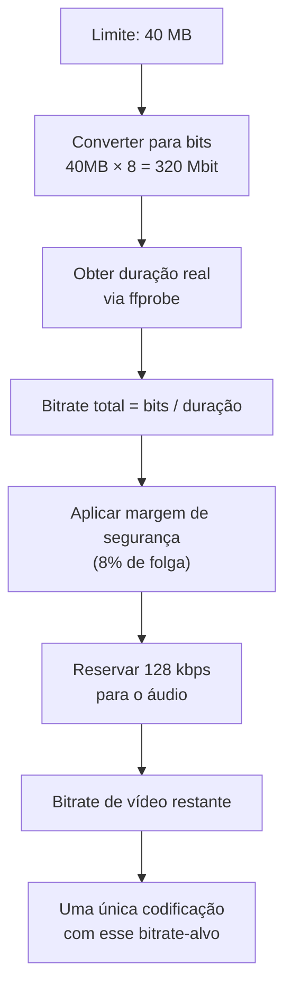

# 🎬 ClipSqueeze

**Compressão de vídeo inteligente, direto do seu terminal PowerShell — CPU ou GPU, perfis com intenção real, e do jeito que você realmente usa: sem precisar decorar flag nenhuma do FFmpeg.**

<p align="center">
  
  
  
  
  
</p>

---

## 💡 Por que este projeto existe

Comprimir um clipe rápido pra mandar no Discord ou no WhatsApp não devia exigir que você saiba a diferença entre CRF e QP, o que é um preset `veryslow`, ou por que seu vídeo de 200MB simplesmente não passa no limite de upload de ninguém.

**ClipSqueeze** gira em torno de uma única função PowerShell, `comprimir`, que vira uma camada de abstração em cima do FFmpeg: você diz **onde** processar (CPU ou GPU), **como** quer priorizar (velocidade, equilíbrio, eficiência ou qualidade) e, se quiser, **quanto** o arquivo final pode pesar. O script cuida do resto.

```powershell
comprimir gpu "nome_do_video" efficient 40mb
```

Isso é tudo que você precisa saber pra usar.

---

## 📑 Sumário

- [Recursos](#-recursos)
- [Como funciona](#-como-funciona)
- [Requisitos](#️-requisitos)
- [Instalação](#-instalação)
- [Uso](#-uso)
- [Perfis de compressão](#️-perfis-de-compressão)
- [Limite de tamanho](#-limite-de-tamanho)
- [Exemplo em ação](#-exemplo-em-ação)
- [Tratamento de erros](#-tratamento-de-erros)
- [Desafios técnicos superados](#-desafios-técnicos-superados)
- [Limitações conhecidas](#-limitações-conhecidas)
- [Roadmap](#️-roadmap)
- [Contribuindo](#-contribuindo)
- [Licença](#-licença)

---

## ✨ Recursos

- 🔍 **Detecção automática de arquivo** — cole o nome do vídeo sem extensão, o script encontra o arquivo certo sozinho.
- 📊 **Painel de progresso real** — barra que preenche de verdade, tempo decorrido, tempo restante estimado e velocidade de codificação, tudo ao vivo.
- ⚡ **CPU ou GPU** — codifique via `libx265` (software) ou aceleração por hardware AMD (`hevc_amf`), sem precisar saber qual encoder usar.
- 🎚️ **Perfis com intenção, não presets crus** — `fast`, `balanced`, `efficient` e `quality` significam a mesma coisa independente do acelerador escolhido.
- 📦 **Restrição de tamanho opcional** — diga `40mb` e o script calcula o bitrate necessário a partir da duração real do vídeo, com margem de segurança. Uma única codificação, sem tentativa e erro.
- 🛠️ **Auto-diagnóstico do FFmpeg** — verifica se `ffmpeg`/`ffprobe` estão instalados e oferece instalar via `winget` na hora, se faltar algo.
- 🧯 **Erros tratados de verdade** — sem falsos positivos, com log salvo automaticamente quando algo dá errado.

---

## 🧠 Como funciona

A ideia central é separar **intenção** de **implementação**. Você nunca fala com o FFmpeg diretamente — fala com um perfil, e o perfil sabe traduzir isso pro encoder certo.


Quando você define um limite de tamanho (ex: `40mb`), o script **não** faz busca binária nem tenta várias vezes até acertar o tamanho — isso seria lento, caro e desnecessariamente complexo. Em vez disso, ele calcula matematicamente o bitrate que deveria produzir um arquivo dentro do orçamento, aplica uma margem de segurança fixa (pra compensar overhead de container) e codifica **uma única vez**.

O limite de tamanho é tratado como uma **restrição**, não como uma meta a ser preenchida. Se o resultado ficar 10% abaixo do limite, ótimo — o script não vai tentar "aproveitar" o espaço que sobrou.

---

## 🛠️ Requisitos

- Windows 10 (1809+) ou Windows 11
- PowerShell 5.1 ou superior
- [FFmpeg](https://www.gyan.dev/ffmpeg/builds/) (o script detecta se está faltando e oferece instalar via `winget` automaticamente)
- Pra aceleração por GPU: uma placa AMD com suporte a AMF (a checagem de disponibilidade do encoder é feita automaticamente antes de qualquer compressão)

---

## 📦 Instalação

1. Baixe o `ClipSqueeze.ps1` deste repositório.
2. Abra seu perfil do PowerShell:
   ```powershell
   notepad $PROFILE
   ```
3. Adicione a linha abaixo, apontando pro caminho onde salvou o arquivo:
   ```powershell
   . "C:\caminho\para\ClipSqueeze.ps1"
   ```
4. Salve, feche o editor e reabra o terminal (ou rode `. $PROFILE` pra recarregar sem fechar).

> 💡 O projeto se chama **ClipSqueeze**, mas o comando que você digita no terminal continua sendo `comprimir` — é o nome que já faz parte do seu fluxo de trabalho.

Se o FFmpeg ainda não estiver instalado, não se preocupe — na primeira execução o script detecta isso e pergunta se pode instalar via `winget` pra você.

---

## 🚀 Uso

```powershell
comprimir <acelerador> <arquivo> [perfil] [limite]
```

| Parâmetro | Obrigatório | Valores aceitos | Padrão |
|---|---|---|---|
| `acelerador` | ✅ | `cpu`, `gpu` | — |
| `arquivo` | ✅ | Nome ou caminho do vídeo (com ou sem extensão) | — |
| `perfil` | ❌ | `fast`, `balanced`, `efficient`, `quality` | `balanced` |
| `limite` | ❌ | Tamanho máximo, ex: `40mb` | Sem limite |

### Exemplos

```powershell
# Compressão simples, perfil balanceado, sem restrição de tamanho
comprimir cpu "clipe_jogando"

# GPU com perfil de melhor qualidade visual
comprimir gpu "clipe_jogando" quality

# GPU priorizando eficiência, respeitando 40MB (ex: limite de upload do Discord)
comprimir gpu "clipe_jogando" efficient 40mb

# CPU rápido, pra um preview descartável
comprimir cpu "clipe_jogando" fast
```

Repare que você não precisa digitar a extensão do arquivo — se `clipe_jogando.mp4` existir na pasta atual, o script encontra sozinho.

---

## 🎛️ Perfis de compressão

Cada perfil representa uma **intenção**, implementada de forma diferente dependendo do acelerador escolhido:

| Perfil | Intenção | CPU (`libx265`) | GPU (`hevc_amf`) |
|---|---|---|---|
| `fast` | Rápido, sem grandes preocupações com tamanho | `preset veryfast`, `crf 27` | `quality speed`, `qvbr 32` |
| `balanced` *(padrão)* | Equilíbrio entre tempo, qualidade e tamanho | `preset medium`, `crf 23` | `quality balanced`, `qvbr 26` |
| `efficient` | Prioriza arquivo pequeno mantendo a qualidade-alvo | `preset veryslow`, `crf 23` | `quality quality`, `qvbr 26` |
| `quality` | Prioriza fidelidade visual acima de tudo | `preset slow`, `crf 18` | `quality quality`, `qvbr 20` |

> Na GPU, o modo de controle de taxa usado é `qvbr` (Quality Variable Bitrate) — o equivalente mais próximo do CRF que o encoder de hardware da AMD oferece.

---

## 📏 Limite de tamanho

Quando você passa algo como `40mb`, o script segue este raciocínio:



A margem de segurança existe porque o cálculo teórico de bitrate não é uma garantia matemática exata — overhead de container, metadata e variação de encoder podem fazer o arquivo físico ficar levemente diferente do previsto. Em vez de compensar isso com múltiplas tentativas, o script já parte de um orçamento um pouco mais conservador.

---

## 🖥️ Exemplo em ação

```
=============================================
 Previsão de compressão
=============================================
 Tempo decorrido : 00:00:54
 Tempo restante  : concluído
 Velocidade      : 1.8x

 Progresso: [########################################] 100%

 Acelerador: gpu | Perfil: efficient | Limite: 20mb
 Saída: 1920x-2
=============================================================

Arquivo: clipe_jogando.mp4
Acelerador: gpu
Perfil: efficient
Limite: 20mb

Duração: 00:33
Bitrate de vídeo (alvo): 4332 kbps
Bitrate de áudio: 128 kbps

Compressão concluída.

Tamanho original: 277.4 MB
Tamanho final: 18.7 MB
Redução: 93.3%
```

*(Saída real de teste — sinta-se livre para substituir por um GIF/asciinema do terminal rodando ao vivo.)*

---

## 🧯 Tratamento de erros

- **FFmpeg ausente** → o script detecta e oferece instalar via `winget` (pacote `Gyan.FFmpeg`) na hora, sem precisar sair do terminal.
- **Encoder de GPU indisponível** → antes de qualquer tentativa de uso da GPU, o script confirma que `hevc_amf` existe na lista de encoders do seu FFmpeg — se sua placa não suportar, você recebe um aviso claro em vez de um erro genérico do FFmpeg.
- **Falha real na codificação** → o `stderr` do FFmpeg é salvo automaticamente como `<nome>_erro_compressao.log`, na mesma pasta do vídeo.
- **Arquivo de saída já existe** → o script pergunta antes de sobrescrever.
- **Limite de tamanho inviável** → se o limite informado for pequeno demais para a duração do vídeo, o script recusa a compressão em vez de gerar um arquivo inutilizável.

---

## 🐛 Desafios técnicos superados

Alguns bugs que apareceram durante o desenvolvimento e valem registrar, porque não eram óbvios:

- **Parsing sensível a localidade (locale)**: em sistemas configurados em `pt-BR`, `[double]::TryParse("33.003000")` interpreta o ponto como separador de milhar, não decimal — transformando 33 segundos em ~33 milhões. A correção foi forçar `CultureInfo.InvariantCulture` em toda conversão numérica vinda do `ffprobe`/`ffmpeg`.
- **Falso positivo de erro**: `Start-Process -PassThru` no PowerShell pode retornar `.ExitCode = $null` mesmo após uma execução bem-sucedida, se o handle do processo não for acessado logo após o `Start-Process`. Resolvido acessando `$proc.Handle` explicitamente.
- **Progresso instável entre builds do FFmpeg**: nem todo build reporta `out_time_ms` de forma consistente. A solução foi calcular o progresso a partir do contador de `frame=` (sempre presente) dividido pelo total de frames esperado (duração × fps), em vez de depender de timestamps.
- **Metadados de duração incorretos em clipes cortados**: vídeos recortados por ferramentas de gravação (ex: Radeon ReLive) às vezes preservam metadados de duração da gravação original, não do clipe cortado — inflando o denominador do cálculo de progresso silenciosamente.

---

## ⚠️ Limitações conhecidas

- A resolução de saída é atualmente fixa em `1920:-2` — vídeos com largura menor que 1920px serão *upscalados* em vez de mantidos no tamanho original (correção planejada, veja Roadmap).
- Aceleração por GPU hoje cobre apenas **AMD (AMF)**. NVIDIA e Intel ainda não são suportados.
- O codec de saída é sempre HEVC (H.265) — não há seletor de codec ainda.

---

## 🗺️ Roadmap

- [ ] Seletor de codec (H.264 / H.265 / AV1) independente do acelerador
- [ ] Suporte a NVIDIA (NVENC) e Intel (QuickSync)
- [ ] Evitar upscale automático quando o vídeo de origem for menor que a resolução alvo
- [ ] Opção de reescrita/limpeza de metadados do vídeo final
- [ ] Instalação automática do FFmpeg também via Chocolatey/Scoop, além do winget

---

## 🤝 Contribuindo

Pull requests são bem-vindos. Para mudanças maiores, abra uma issue primeiro descrevendo o que você gostaria de alterar — principalmente se envolver a matriz de perfis ou o cálculo de bitrate, pra manter a filosofia de "uma codificação só, sem otimização iterativa".

---

## 📄 Licença

Distribuído sob a licença MIT. Veja [LICENSE](LICENSE) para mais detalhes.

---

<p align="center">Feito com PowerShell, FFmpeg e um número desconfortável de horas debugando bug de locale.</p>
